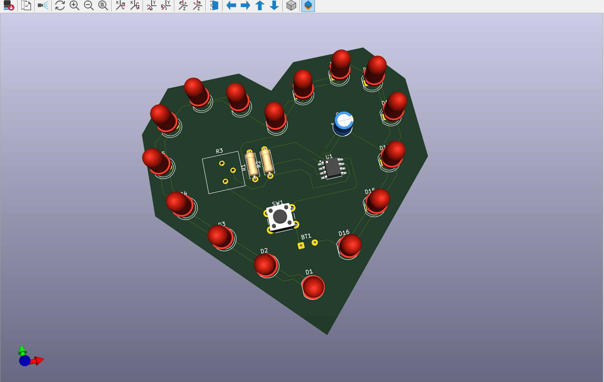
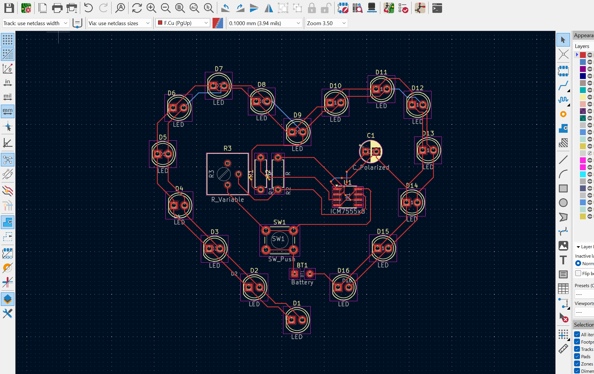

# Heart PCB

## Components Used
- Red LEDs (16x)
- 330 Ohm resistor (1x)
- 10k Ohm resistor (1x)
- 100k Ohm variable resistor / potentiometer (1x)
- 555 Timer IC (1x)
- 10uF Capacitor (1x)
- Push Button (1x)
- 9V Battery holder clip (1x)

## Journal 
I used KiCad to design this heart shaped PCB. At first, I used the scematic tool to search up all the components I needed and added footprints to them. Then, I imported the design in the PCB editor. I arranged the components somewhat in the heart shape and later drew a heart shape around it on edge.cut layer. After proper placement of all components I moved to F.Cu layer and routed most of the connections. For the ones that overlapped on top, I moved to B.Cu layer and added some vias to connect those routing in the back layer. Throughout the process I ran the Design Rule Check (DRC) form the inspect tool frequently to check out the errors I had. And then we're done!

Made w love, 
Afia :)
